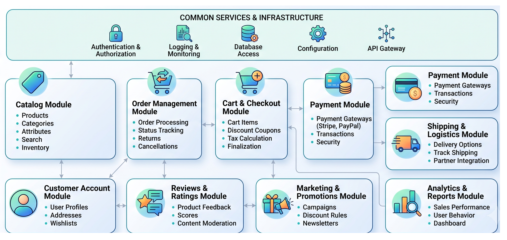

# 🛍️ Next-Gen Open-Source E-Commerce Hub
### *A high-performance C2C/B2C architecture*

---

## 🎯 Mission

Engineer a **lightweight, clean, and highly efficient** cloud-native foundation for modern e-commerce. Built to strip away the bloat often found in enterprise retail systems, this open-source ecosystem serves as a premier **case study and rapid-prototyping sandbox** for developers and businesses looking to test, validate, and deploy cutting-edge e-commerce features at scale.

---

## 🛠️ Core Stack & Architecture

This project demonstrates a production-grade, distributed architecture designed for **maximum throughput and minimal latency**:

| Component | Technology / Pattern | Purpose |
| :--- | :--- | :--- |
| **Backend** | Java / Spring Boot | Clean Architecture & Domain-Driven Design (DDD) |
| **Data Streaming** | Apache Kafka | Asynchronous order processing, notifications, and inventory sync |
| **Database** | PostgreSQL | Optimized indexing and relational integrity |
| **Infra & DevOps** | Kubernetes & Terraform | Orchestration and Infrastructure as Code (IaC) |
| **Cloud Provider** | Amazon Web Services (AWS) | Cloud-native hosting and managed services |
| **CI/CD** | Automated Pipelines | Continuous integration for seamless, zero-downtime deployments |

---

## ✨ Core Features *(Optimized for Prototyping)*

*   **Hybrid Business Model:** Seamless support for both official B2C storefronts and peer-to-peer (C2C) user listings.
*   **Dynamic Product Feed:** Ultra-fast negotiation capabilities, smart categorization, and lightweight tag-based discovery.
*   **Merchant Dashboard:** An intuitive, streamlined hub for real-time inventory control, dynamic pricing, and fulfillment management.
*   **Frictionless Checkout:** An optimized, high-conversion simulated payment flow designed to benchmark performance and checkout UX.
*   **Extensible & Plug-and-Play:** A modular codebase built for scale—fully customizable and ready to benchmark new payment gateways, AI recommendation engines, or logistics APIs.

---

## 💡 Why this project?

> Instead of dealing with monolithic, legacy e-commerce platforms, this repository provides a **clean slate**. It allows you to isolate features, test architectural patterns (like event-driven microservices with Kafka), and see exactly how a modern Java stack behaves under simulated production loads in AWS.

---

## ⚖️ License

This project is open-source and licensed under the **Apache License 2.0**. You are free to use, modify, and extend this codebase for both personal studies and commercial benchmarking.

